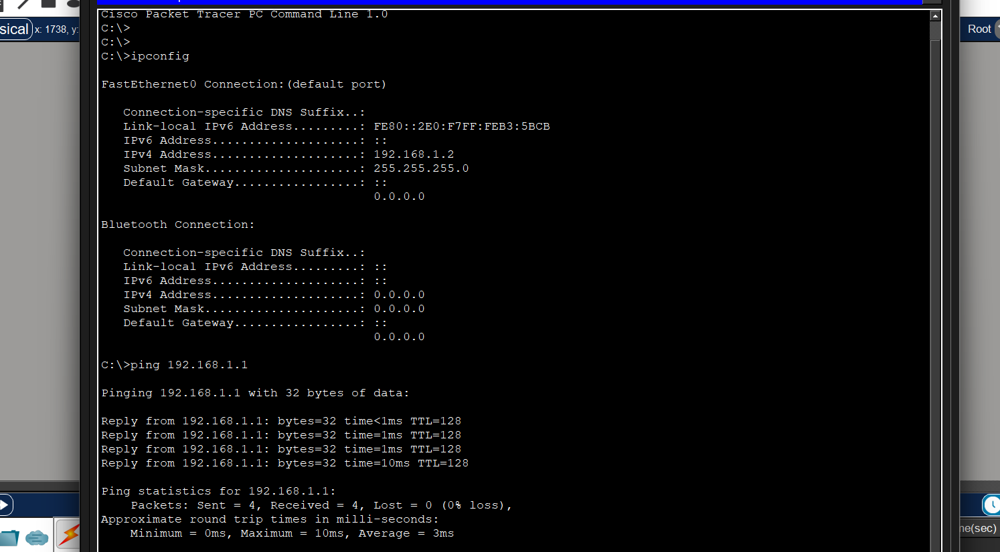

# Static IP Configuration Lab

## Objective
To configure two PCs with static IP addresses and test connectivity.

---

## Topology

---

## IP Configuration

---

## Ping Test Result

## Packet Tracer File

You can download the Packet Tracer file here:

[Download Static IP Lab](static-ip-lab.pkt)
